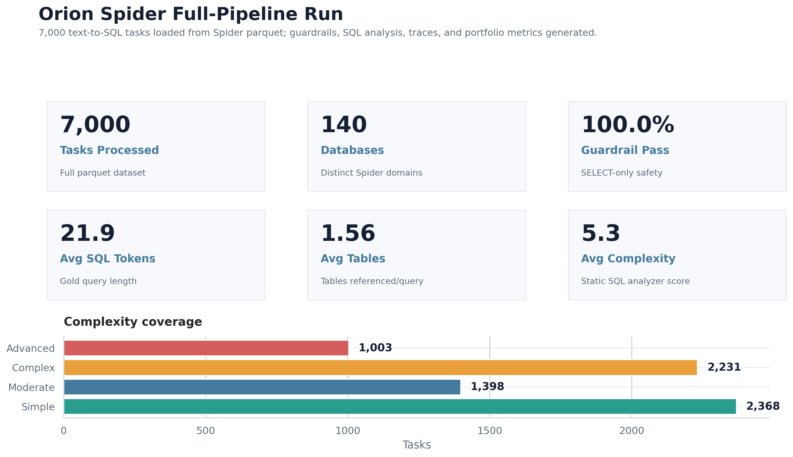

# Orion Tool Agent

Orion is a tool-using agent framework with SQL guardrails, deterministic planning, auditable traces, and offline text-to-SQL diagnostics.

The project demonstrates a compact agent runtime built around practical tool orchestration: a planner routes user tasks to SQL, retrieval, calculator, and file tools; guardrails enforce read-only SQL and sandboxed file access; every tool call is written to a trace for inspection and regression analysis.

## Core Capabilities

- Deterministic planner for reproducible demonstrations and CI checks.
- SQL tool with SELECT-only enforcement.
- Local knowledge retrieval over Markdown reference material.
- Safe calculator and sandboxed file-read tools.
- Structured trace capture for each tool call.
- Full Spider text-to-SQL diagnostic pipeline over query complexity, SQL features, domains, and guardrail outcomes.

## Dataset

The included dataset is `data/train-00000-of-00001_spider.parquet`, a Spider text-to-SQL training split stored as parquet. Each row contains a natural-language question, database identifier, SQL program, and related schema metadata. The repository uses this dataset for static SQL diagnostics and guardrail validation.

Execution accuracy is intentionally not reported because the original SQLite database files are not included. The generated metrics therefore focus on dataset coverage, SQL feature analysis, complexity distribution, and guardrail behavior.

## Full-Run Results

The full dataset was processed through `scripts/run_spider_full_pipeline.py`.

| Metric | Result |
|---|---:|
| Tasks processed | 7,000 |
| Unique databases | 140 |
| SELECT-only guardrail pass rate | 100.0% |
| Average SQL length | 21.9 tokens |
| Median SQL length | 16.0 tokens |
| Average complexity score | 5.3 |

Lead result:



Additional figures:

- `outputs/spider_full_pipeline/figures/02_sql_feature_coverage.png`
- `outputs/spider_full_pipeline/figures/03_database_distribution.png`
- `outputs/spider_full_pipeline/figures/04_complexity_mix.png`
- `outputs/spider_full_pipeline/figures/05_question_vs_sql_length.png`
- `outputs/spider_full_pipeline/figures/06_pipeline_tooling_outcomes.png`

Generated artifacts:

- `outputs/spider_full_pipeline/metrics/spider_full_pipeline_metrics.json`
- `outputs/spider_full_pipeline/spider_full_pipeline_results.csv`
- `outputs/spider_full_pipeline/traces/spider_full_pipeline_traces.jsonl`
- `outputs/spider_full_pipeline/README.md`

## Architecture

```text
User task or Spider row
  -> deterministic planner or offline dataset loader
  -> tool routing and SQL analysis
  -> SELECT-only guardrail
  -> tool result or static diagnostic
  -> trace, metrics, report, and figures
```

## Quickstart

```bash
python -m venv .venv
pip install -e .
PYTHONPATH=src pytest -q
PYTHONPATH=src python scripts/run_spider_full_pipeline.py
```

Small built-in demo:

```bash
bash scripts/generate_outputs.sh
```

## Repository Layout

```text
data/               Demo data and Spider parquet
outputs/            Generated metrics, traces, tables, and figures
scripts/            Demo and full-dataset runners
src/orion_agent/    Agent runtime, tools, guardrails, and evaluator
tests/              Unit tests
```
