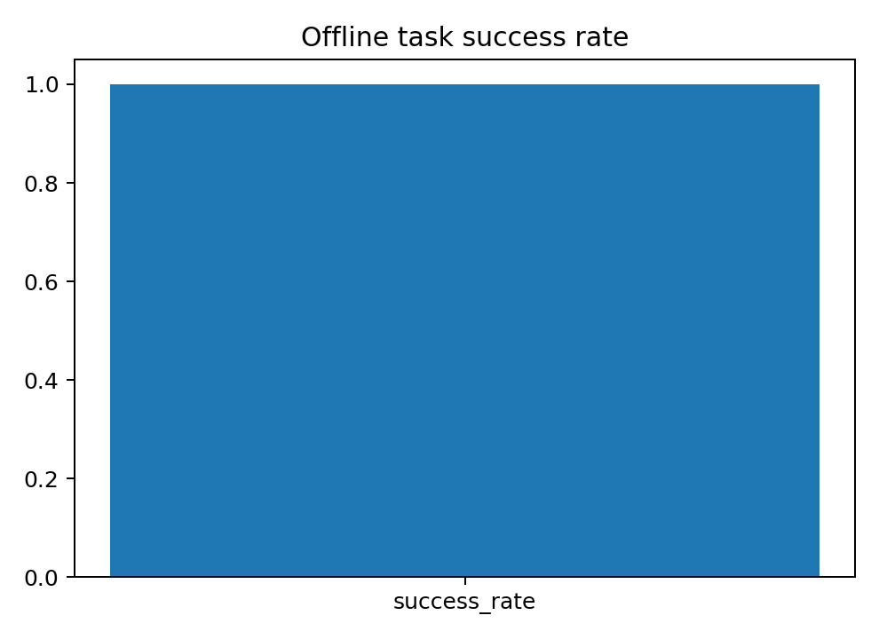
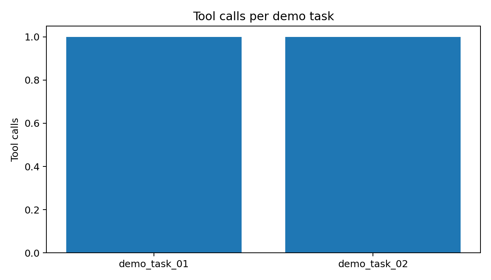

# Orion Tool Agent
**Tool-using agent framework with guardrails, auditable traces, and offline task evaluation.**


---

## Overview

Orion is a small tool-using agent built for enterprise-style workflows. The demo agent can:

- query a **SQLite** support-ticket database (SELECT-only enforcement)
- retrieve from a small local knowledge base
- use a calculator tool
- emit an **auditable trace** of tool calls (arguments + observations)

The repo also includes an offline evaluator that runs a JSONL task set and reports success rate.

---

## Built-in tools & guardrails

- **SQL tool** with read-only (SELECT-only) enforcement
- **knowledge retriever** (local files)
- **calculator**
- deterministic rule planner for reproducible demos (with an interface for LLM planners)
- trace capture for audit/debugging

---

## Included outputs (already generated)

```text
outputs/metrics/eval_metrics.json
outputs/reports/EXPERIMENT_REPORT.md
outputs/traces/demo_task_01.json
outputs/traces/demo_task_02.json
outputs/logs/run_demo.log
outputs/figures/success_rate.png
outputs/figures/tool_calls_per_task.png
```

### Preview

**Offline task success rate**



**Tool calls per task**



---

## Run

```bash
bash scripts/generate_outputs.sh
```

Open the report:

- `outputs/reports/EXPERIMENT_REPORT.md`

---

## Tests

```bash
PYTHONPATH=src pytest -q
```

---

## Trace format (example)

A trace contains tool calls and observations:

```json
{
  "trace": [
    {
      "tool": "sql",
      "args": {"query": "SELECT COUNT(*) AS open_p0 FROM tickets WHERE priority='P0' AND status='open'"},
      "observation": "[{'open_p0': 1}]"
    }
  ]
}
```

---

## Notes

- The deterministic planner keeps demos reproducible.
- Traces are captured without exposing private chain-of-thought.

